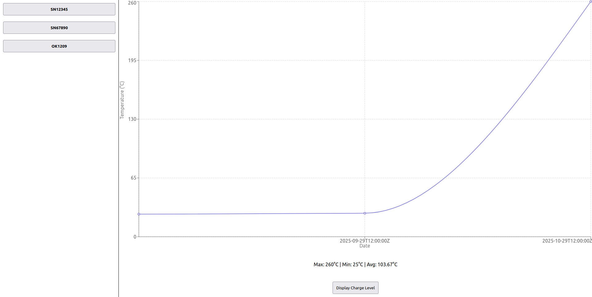

# GES-test

This repository is used to share the test for Green Energy Service.

The repository is co;posed of two parts.

## Battery API

This is an API for managing the different batteries. By default, it should launch on ```http://localhost:8000```.
To call the different endpoints, use ```token123``` as your Authorization header in your request.

## Battery Visualisation

This is a quick React project that allows for a visualisation of the different battery and their information.
By default, it should launch on ```http://localhost:3000```.

## To run the project

### API

To start the API, you can follow the instructions given in the ```README.md``` file in the ```battery-api``` folder.

### Frontend

To start the frontend, you can follow the instructions given in the ```README.md``` file in the ```battery-visualize``` folder.


The JSON file used as database will be pushed with the project for anyone starting the project to have already existing data.
With that said, feel free to add more batteries or measurements if you feel like it!

## Screenshot

Here is what the project should look like.

